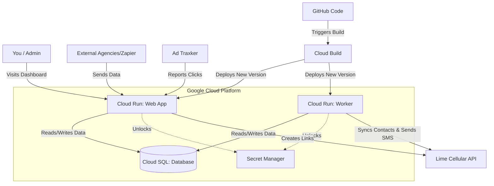

# Cloud Architecture Explained ☁️

This document explains **what** we built, **why** we needed each piece, and **how** it all connects—written for anyone to understand, regardless of technical background.

---

## 1. The Building Blocks (Services) 🏗️

Think of these services as the different "departments" of your digital business.

### **Google Cloud Run (The Computers)**
*   **What it is**: serverless computing. It runs your code.
*   **Why we need it**: Instead of buying a server that runs 24/7 (and paying for it even when you sleep), Cloud Run spins up "containers" (mini-servers) only when someone visits your website or when work needs to be done.
*   **We have TWO parts here**:
    1.  **Web App**: The dashboard you see (`lime-sms-app`). It handles login, settings, and subscriber lists.
    2.  **Worker**: The invisible employee. It runs in the background to handle the heavy lifting (syncing 150k contacts, sending daily SMS blasts).

### **Google Cloud SQL (The Filing Cabinet)**
*   **What it is**: A managed PostgreSQL database.
*   **Why we need it**: All your data—subscribers (150k+), message logs, clicks, and settings—needs a permanent home. If the "Computers" (Cloud Run) crash or restart, they forget everything. The "Filing Cabinet" (Cloud SQL) remembers everything forever and keeps it safe.

### **Google Secret Manager (The Safe)**
*   **What it is**: A secure vault for sensitive passwords.
*   **Why we need it**: We never want to write passwords (like your Database password or Lime API Key) directly in the code. If someone stole the code, they'd have the keys to the castle. Instead, we put them in the "Safe", and only the "Computers" (Cloud Run) are allowed to peek inside when they start up.

### **Google Cloud Build (The Construction Crew)**
*   **What it is**: An automated deployment tool.
*   **Why we need it**: Every time you save code to GitHub, this crew wakes up, reads your blueprints (`cloudbuild.yaml`), builds the new version of the app, tests it, and replaces the old version on Cloud Run automatically.

---

## 2. The Nervous System (Internal APIs) ⚡

These are the special commands your app uses to talk to itself and the outside world.

| API Endpoint | Translation | Why we need it |
| :--- | :--- | :--- |
| **`/api/shorten`** | "Make this link short" | To turn `mysite.com/very-long-promo-url` into `tr.limetrak.com/s/xyz` so it fits in a text message and we can count who clicks it. |
| **`/api/webhooks/analytics`** | "Record a sale/click" | When a user buys something or clicks an ad, third-party trackers tell this endpoint so we can calculate ROI. |
| **`/api/subscribers`** | "Add/Update Contact" | Allows other tools (like Zapier or your website forms) to instantly push new user data into our system. |
| **`/api/send-direct`** | "Send SMS Now" | Bypasses the waiting line to send an urgent message to one specific person immediately. |
| **`/api/cron`** | "Start Work" | The "alarm clock" that tells the Worker to wake up and start syncing contacts or sending queued messages. |

---

## 3. How It All Connects (Architecture Diagram) 🔄

Here is the flow of data through your system:

### The Flow Explained:
1.  **You** visit the Dashboard (Web App) to write a Message.
2.  The **Web App** saves that message to the **Database**.
3.  The **Worker** wakes up, checks the **Database** for new messages, and sees 10,000 people need to receive it.
4.  The **Worker** talks to **Lime Cellular** to send the texts.
5.  If you change any code, **Cloud Build** automatically updates both the Web App and the Worker.

---

## 4. How Secrets Work (The "Digital Vault") 🔐

Security is often confusing, so here is the simplest analogy:

1.  **The Secret**: Imagine a slip of paper with your database password (`SuperSecret123`).
2.  **The Vault (Secret Manager)**: We put that paper in a digital vault inside Google Cloud. We give this vault a name, like `DATABASE_URL`.
3.  **The Code**: In your code, we never write `SuperSecret123`. We write: *"Go look in the vault specificed by `DATABASE_URL`"*.
4.  **The Access Card**: When we deploy your app to Cloud Run, we give that specific Cloud Run service an "ID Card" (IAM Permission) that allows it—and **only** it—to open the vault.
5.  **The Result**: When the app starts, it uses its ID card, opens the vault, reads the password into its memory, and connects to the database. If a hacker steals your code repository, they see nothing but the instruction *"Go look in the vault"*—which they can't open.
