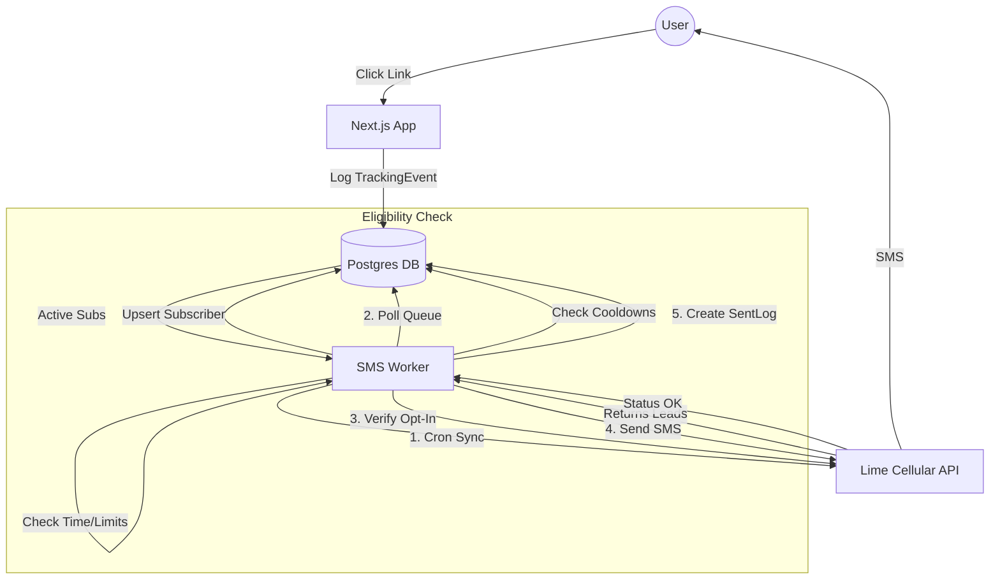

# Data Flow Diagram

```mermaid
graph TD
    User((User))
    Lime[Lime Cellular API]
    DB[(Postgres DB)]
    Worker[SMS Worker]
    Web[Next.js App]

    %% Sync Flow
    Worker -- 1. Cron Sync --> Lime
    Lime -- Returns Leads --> Worker
    Worker -- Upsert Subscriber --> DB

    %% Sending Flow
    Worker -- 2. Poll Queue --> DB
    DB -- Active Subs --> Worker
    
    subgraph "Eligibility Check"
        Worker -- Check Time/Limits --> Worker
        Worker -- Check Cooldowns --> DB
    end

    Worker -- 3. Verify Opt-In --> Lime
    Lime -- Status OK --> Worker
    Worker -- 4. Send SMS --> Lime
    Lime -- SMS --> User
    Worker -- 5. Create SentLog --> DB

    %% Analytics Flow
    User -- Click Link --> Web
    Web -- Log TrackingEvent --> DB
```
