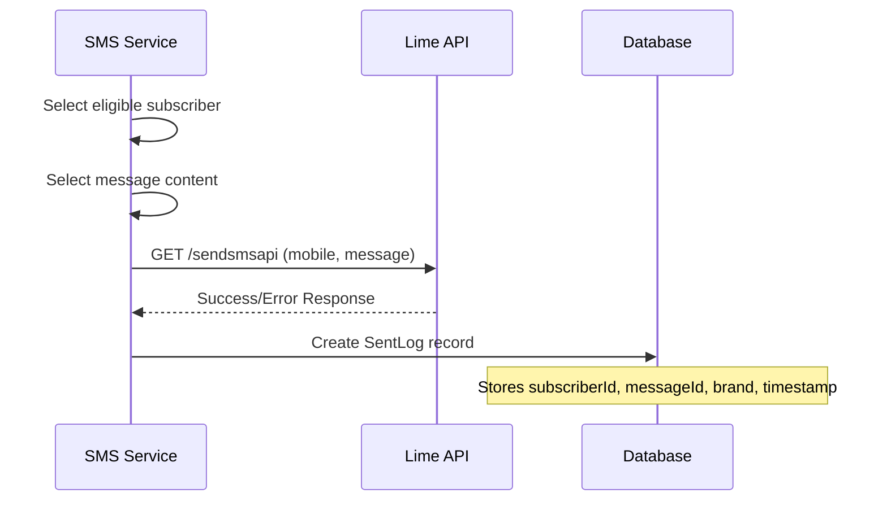
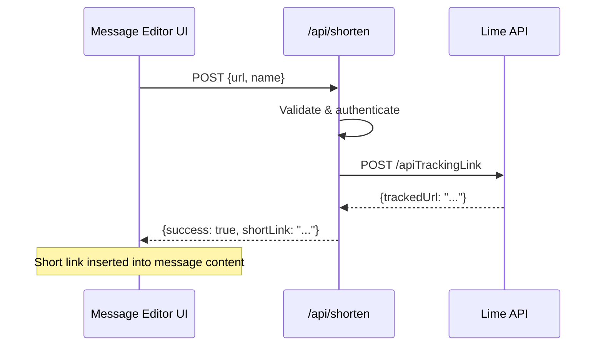
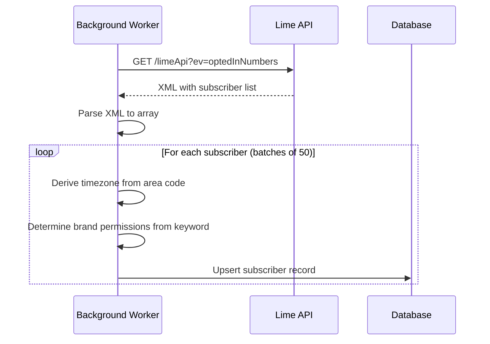
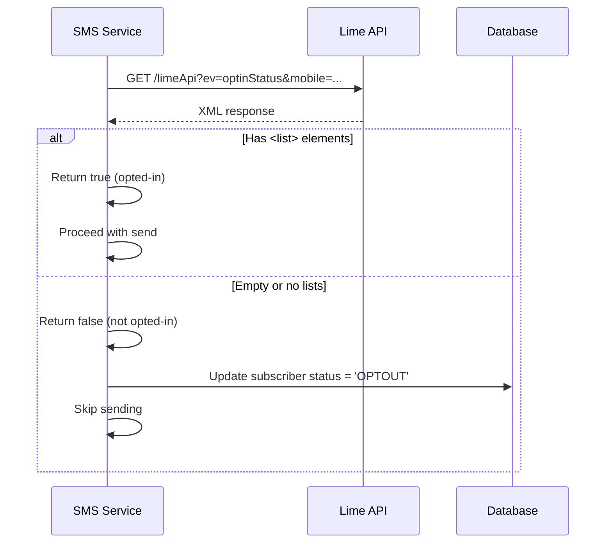
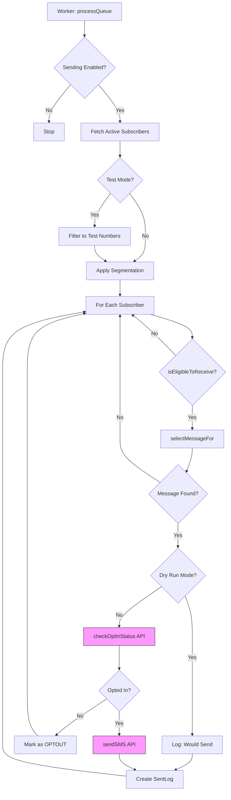
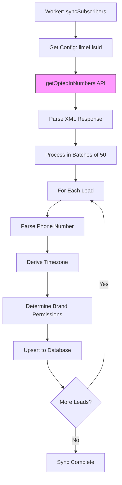

# Lime Cellular API Reference

This document provides comprehensive documentation for all Lime Cellular API requests. Each section covers the endpoint, purpose, request/response formats, and how the data is processed.

---

## Table of Contents

1. [Authentication](#authentication)
2. [API Endpoints](#api-endpoints)
   - [Send SMS](#1-send-sms)
   - [Create Tracking Link](#2-create-tracking-link)
   - [Get Opted-In Numbers](#3-get-opted-in-numbers)
   - [Check Opt-In Status](#4-check-opt-in-status)
3. [Data Flow Diagrams](#data-flow-diagrams)
4. [Error Handling](#error-handling)
5. [Environment Variables](#environment-variables)

---

## Authentication

All Lime API requests require two authentication credentials:

| Parameter | Environment Variable | Description |
|-----------|---------------------|-------------|
| `user` | `LIME_USER` | Your Lime Cellular account username |
| `api_id` | `LIME_API_ID` | Your Lime Cellular API ID/Key |

These credentials should be injected from environment variables via a configuration function.

---

## API Endpoints

### 1. Send SMS

**Purpose:** Sends a one-way SMS text message to a mobile phone number.

#### Endpoint Details

| Property | Value |
|----------|-------|
| **URL** | `https://mcpn.us/sendsmsapi` |
| **Method** | `GET` |
| **Response Format** | XML/Text |

#### Request Parameters

| Parameter | Type | Required | Description |
|-----------|------|----------|-------------|
| `user` | string | Yes | Lime account username |
| `api_id` | string | Yes | Lime API ID |
| `mobile` | string | Yes | Destination phone number (E.164 format) |
| `message` | string | Yes | The SMS content to send |

#### Example Request

```
GET https://mcpn.us/sendsmsapi?user=myuser&api_id=myapiid&mobile=12125551234&message=Hello%20World
```

#### Response Handling

- **Success:** Returns response data (format varies)
- **Error:** Response contains `error` field with `error_text` description

#### Typical Use Cases

| Function | Context |
|----------|---------|
| `sendMessage()` | Queue processing - sends SMS to eligible subscribers |
| `sendDirectMessage()` | Direct sending - bypasses queue for immediate delivery |

#### Data Flow



#### Outgoing Data

| Field | Source | Example |
|-------|--------|---------|
| `mobile` | `subscriber.phone` | `"12125551234"` |
| `message` | `message.content` | `"Check out this deal: https://sms1.px1.co/abc123"` |

#### Incoming Data

| Field | Description | How It's Used |
|-------|-------------|---------------|
| Response body | Success indicator or error | Logged; errors are thrown as exceptions |
| `error` | Error flag | Triggers exception if present |
| `error_text` | Error description | Included in thrown exception message |

---

### 2. Create Tracking Link

**Purpose:** Creates a shortened, trackable URL that captures click events and user engagement.

#### Endpoint Details

| Property | Value |
|----------|-------|
| **URL** | `https://mcpn.us/apiTrackingLink` |
| **Method** | `POST` |
| **Content-Type** | `application/json` |
| **Response Format** | JSON |

#### Request Body

| Field | Type | Required | Description |
|-------|------|----------|-------------|
| `user` | string | Yes | Lime account username |
| `apiId` | string | Yes | Lime API ID (camelCase) |
| `name` | string | Yes | Human-readable link identifier |
| `domain` | string | Yes | Short link domain (e.g., `sms1.px1.co`) |
| `url` | string | Yes | Original destination URL |
| `isTrackUsers` | boolean | No | Enable user-level tracking (default: `true`) |
| `listId` | number | No | Associate with specific subscriber list |

#### Example Request

```json
{
  "user": "myuser",
  "apiId": "myapiid",
  "name": "Holiday Promo 2024",
  "domain": "sms1.px1.co",
  "url": "https://example.com/promo?utm_source=sms",
  "isTrackUsers": true
}
```

#### Response

| Field | Description |
|-------|-------------|
| `trackedUrl` | The shortened tracking URL |
| `errorCode` | Error code (only on failure) |
| `message` | Error message (only on failure) |

#### Example Response (Success)

```json
{
  "trackedUrl": "https://sms1.px1.co/abc123"
}
```

#### Typical Use Cases

| Function | Context |
|----------|---------|
| `POST /api/shorten` | Internal API endpoint for link shortening |

#### Data Flow



#### Outgoing Data

| Field | Source | Description |
|-------|--------|-------------|
| `url` | User input | Original destination URL (often includes UTM params) |
| `name` | User input or auto-generated | Link identifier (e.g., `"Link 2024-12-30T12:00:00Z"`) |
| `domain` | `LIME_DOMAIN` env var | Default: `sms1.px1.co` |

#### Incoming Data

| Field | Description | How It's Used |
|-------|-------------|---------------|
| `trackedUrl` | Shortened URL | Returned to client for use in SMS messages |
| `short_url` | Alternate field name | Fallback if `trackedUrl` not present |
| `url` | Alternate field name | Second fallback |

> [!IMPORTANT]
> The tracking link captures click events. When a subscriber clicks the link, Lime sends a webhook to your analytics endpoint with click event data.

---

### 3. Get Opted-In Numbers

**Purpose:** Fetches all subscribers from a specific opt-in list. Used for syncing the local database with Lime's subscriber list.

#### Endpoint Details

| Property | Value |
|----------|-------|
| **URL** | `https://mcpn.us/limeApi` |
| **Method** | `GET` |
| **Response Format** | XML |
| **Timeout** | 600,000ms (10 minutes) |

#### Request Parameters

| Parameter | Type | Required | Description |
|-----------|------|----------|-------------|
| `ev` | string | Yes | Event type: `"optedInNumbers"` |
| `user` | string | Yes | Lime account username |
| `api_id` | string | Yes | Lime API ID |
| `optInListId` | string | Yes | The Lime list ID to fetch |

#### Example Request

```
GET https://mcpn.us/limeApi?ev=optedInNumbers&user=myuser&api_id=myapiid&optInListId=135859
```

#### Response Format (XML)

```xml
<Mobiles>
  <Mobile>
    <MobileNumber>12125551234</MobileNumber>
    <FirstName>John</FirstName>
    <LastName>Doe</LastName>
    <Email>john@example.com</Email>
    <Keyword>STOCK</Keyword>
  </Mobile>
  <Mobile>
    <MobileNumber>13105559876</MobileNumber>
    <FirstName>Jane</FirstName>
    <LastName>Smith</LastName>
    <Email>jane@example.com</Email>
    <Keyword>TRADEALERTS</Keyword>
  </Mobile>
</Mobiles>
```

#### Typical Use Cases

| Function | Context |
|----------|---------|
| `syncSubscribers()` | Periodic sync to update local subscriber database |

#### Data Flow



#### Incoming Data

| XML Field | Maps To | Description |
|-----------|---------|-------------|
| `MobileNumber` | `subscriber.phone` | Phone number (primary key) |
| `FirstName` | `subscriber.firstName` | Subscriber's first name |
| `LastName` | `subscriber.lastName` | Subscriber's last name |
| `Email` | `subscriber.email` | Email address (on create only) |
| `Keyword` | Derived fields | Used to set subscription preferences |

#### Data Transformation Logic

```typescript
// Keyword-based permission logic
const keywordRaw = (lead.Keyword || '').toUpperCase();
const subscribe_wswd = keywordRaw.includes('STOCK');
const subscribe_ta = keywordRaw.includes('TRADE');
const enableFallback = (!subscribe_wswd && !subscribe_ta);

// If no specific keyword, enable both brands as fallback
subscribe_wswd = subscribe_wswd || enableFallback;
subscribe_ta = subscribe_ta || enableFallback;
```

#### Timezone Derivation

| Input | Processing | Output |
|-------|------------|--------|
| Phone number | Extract area code → Lookup in timezone map | Timezone string (e.g., `"America/New_York"`) |

> [!NOTE]
> The 10-minute timeout accommodates large subscriber lists (10,000+ contacts). Sync should run via a background worker to avoid blocking the main application.

---

### 4. Check Opt-In Status

**Purpose:** Verifies if a specific phone number is currently opted-in to any list. Used as a safety check before sending messages.

#### Endpoint Details

| Property | Value |
|----------|-------|
| **URL** | `https://mcpn.us/limeApi` |
| **Method** | `GET` |
| **Response Format** | XML |

#### Request Parameters

| Parameter | Type | Required | Description |
|-----------|------|----------|-------------|
| `ev` | string | Yes | Event type: `"optinStatus"` |
| `user` | string | Yes | Lime account username |
| `api_id` | string | Yes | Lime API ID |
| `mobile` | string | Yes | Phone number to check |
| `type` | string | Yes | Status type: `"optin"` |

#### Example Request

```
GET https://mcpn.us/limeApi?ev=optinStatus&user=myuser&api_id=myapiid&mobile=12125551234&type=optin
```

#### Response Format (XML)

**Opted-In:**
```xml
<lists type="optin">
  <list>
    <id>135859</id>
    <name>Main SMS List</name>
  </list>
</lists>
```

**Not Opted-In:**
```xml
<lists type="optin" />
```

#### Typical Use Cases

| Function | Context |
|----------|---------|
| `sendMessage()` | Pre-send safety check (skipped in dry run mode) |

#### Data Flow



#### Incoming Data

| Field | Description | Interpretation |
|-------|-------------|----------------|
| `lists.list` (exists) | At least one list present | User is opted-in, safe to send |
| `lists.list` (empty/missing) | No lists found | User is NOT opted-in, block send |

#### Safety Behavior

| Scenario | Action |
|----------|--------|
| Opted-in | Proceed with SMS send |
| Not opted-in | Mark subscriber as `OPTOUT` in database, skip send |
| API error | Return `false` (fail-safe), skip send |
| Dry run mode | Skip this check entirely (no API call made) |

> [!CAUTION]
> This check is critical for TCPA compliance. Never send to numbers that fail this check. The system should automatically mark failed numbers as `OPTOUT` to prevent future attempts.

---

## Data Flow Diagrams

### Complete Message Send Flow



### Subscriber Sync Flow



---

## Error Handling

| API | Error Type | Handling |
|-----|------------|----------|
| sendSMS | API error response | Throws exception with `error_text` |
| sendSMS | Network failure | Logged to console, exception thrown |
| createTrackingLink | `errorCode` in response | Throws exception with `message` |
| getOptedInNumbers | Any error | Throws exception (sync aborts) |
| checkOptInStatus | Any error | Returns `false` (fail-safe) |

> [!TIP]
> The `checkOptInStatus` function should be designed to fail safely. If there's any error (network, parsing, etc.), it returns `false` to prevent sending to potentially opted-out numbers.

---

## Environment Variables

| Variable | Required | Default | Description |
|----------|----------|---------|-------------|
| `LIME_USER` | Yes | - | Lime Cellular account username |
| `LIME_API_ID` | Yes | - | Lime Cellular API ID |
| `LIME_DOMAIN` | No | `sms1.px1.co` | Domain for shortened tracking links |

### Example `.env` Configuration

```bash
LIME_USER="your_username"
LIME_API_ID="your_api_id"
LIME_DOMAIN="sms1.px1.co"
```

---

## Suggested Implementation Files

| File | Description |
|------|-------------|
| `lib/lime-client.ts` | Core API client with all Lime methods |
| `lib/sms-service.ts` | High-level service orchestrating subscriber sync and message sending |
| `app/api/shorten/route.ts` | API endpoint for creating tracking links |
| `scripts/worker.ts` | Background worker that runs sync and queue processing |

---

*Last Updated: December 30, 2024*
